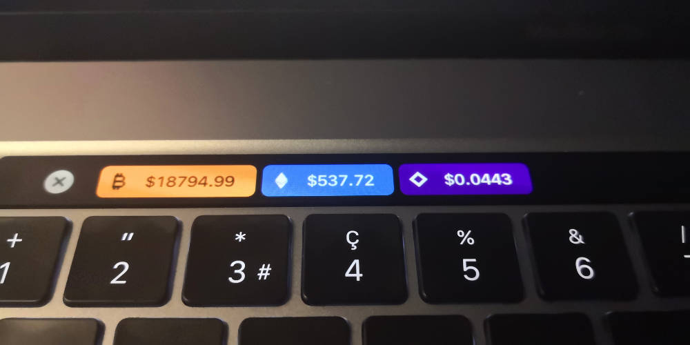

# bettertouchtool-crypto
Crypto stock market prices for your Macbook Pro touch bar! Values updated every minute.

Currently supported coins: 
- **Bitcoin** - Pulled from Coinbase.com API.
- **Ethereum** - Pulled from Coinbase.com API.
- **Lamden** - Pulled from TxBit.io API.

# Notes: 
- All values are in USD.
- For **Lamden** the USD price is calculated by the last Ethereum-swap transaction multiplied by the current Coinbase value of Ethereum.
- Once installed, you can delete any coins you are not interested in tracking.

# To Install

1. Download and install [Better Touch Tool](https://folivora.ai/). It allows you to modify your touch bar and other cool things. It's a 45-day trial but "pay what you like" to register.
2. Right-click and download this file and unzip it: [master.zip](https://github.com/shoutcool/bettertouchtool-crypto/archive/master.zip)
3. In your Mac's menu bar, click the Better Touch Tool `icon > Preferences`.
4. In the bottom left corner of the popup go to `Manage Presets`. 
5. Click the "Import" button and select the [crypto.json](https://raw.githubusercontent.com/shoutcool/bettertouchtool-crypto/master/crypto.json) file you downloaded from the zip file in step 2. Voilà you're done!
7. Note that you can toggle these separate presets on and off in the BetterTouchTool settings.

# Customization

- In the Better Touch Tool preferences panel, you can add, delete, and rearrange the currencies.
- Timing: Currently each currency is refreshed every 60 seconds. Change this by going to Better Touch Tool preferences panel, clicking on a currency, going to "advanced configuration", and adjusting the "run script every x seconds" amount. It's not recommended to go under 30 seconds or the server could ban you.
- Changing the logo of any coin: Download or make a .PNG version of the file. It's best if it has a clear background. In BetterTouchTool preferences go to the coin you want to change and drag your PNG file on to the old logo.
- Changing the background color of a logo: Same step as the previous line except you go to "Advanced Configuration" and edit "Touchbar button color". 

# Acknowledgments

Thanks to the original source [here](https://github.com/krunkosaurus/bettertouchtool-crypto) for sharing this great tool to the crypto community!
